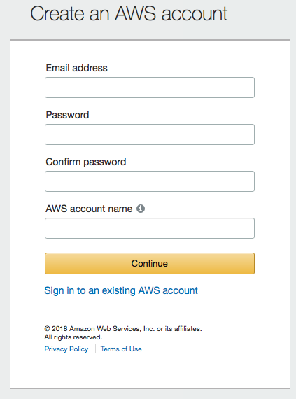

# Overview

This repository contains the code examples and prerequisite materials for the hands-on Deep Learning Tutorial at the ISMRM Machine Learning Workshop 2018, as well as instructions for creating a new AWS EC2 GPU instance pre-configured with all the required Python dependencies, CUDA/cudNN libraries and training data for following along the course.

1. How to create a new AWS EC2 instance.
2. How to login and use AWS EC2 instance.  
3. How to run Jupyter notebook.

# Create AWS Instance

### Sign up for AWS account

New users to Amazon AWS have access to a free tier of services for the initial 12 months of subscription. Note that the GPU EC2 instance required for deep learning is not part of the free tier of services ($0.90/hour) however an Amazon AWS account is still required. 

To sign up, begin by visiting: https://portal.aws.amazon.com/billing/signup#/start 



Note that your chosen `AWS account name` cannot contain spaces or non-alphanumeric characters (`{}[]()/\'"~,;:.<>`). 

Follow the prompts on the remaining screens. A valid credit card will be required.

### Login to EC2 console (dashboard)

Use the following link to log into your new AWS account: https://console.aws.amazon.com/console/home

### Create a new EC2 instance

# Accessing AWS Instance

### Launch EC2 instance 

### SSH into EC2 instance

### Stop EC2 instance 

# Starting Jupyter Notebook 

During the tutorial session, all code written by the participants will be completed using the Jupyter Notebook, an iPython kernel / server that will be running from your own personal AWS instance and accessed through a web-browser. Through this web-based interface one will be able to write, edit and run code in an easy way without needing to use the Linux command line. For more advanced users, this entire Github repository is available for access from the command line at `~/dl_tutorial`. See below for more information.

# Advanced Users

For more advanced users wishing to follow along directly through the EC2 command line instead of the Jupyter Notebook, these are instructions for basic access. In the EC2 instance, all required dependencies have been installed in a separate Conda virtual enivornment named `dl_aws`. To activate simply run:
```
source activate dw_aws
```

From here simply access code and materials from this cloned Github repository at `~/dl_tutorial`. You may use your favorite editor. Note that `vim` has been preconfigured with syntax highlighting, Vundle and several useful plugins for Python development (see `~/.vimrc` for further details). Code may be executed with either `python` or the `ipython` kernel.
