# Overview

This repository contains the code examples and prerequisite materials for the hands-on Deep Learning Tutorial at the ISMRM Machine Learning Workshop 2018, as well as instructions for creating a new AWS EC2 GPU instance pre-configured with all the required Python dependencies, CUDA/cudNN libraries and training data for following along the course.

1. How to create a new AWS EC2 instance.
2. How to access the  AWS EC2 instance.  
3. How to run Jupyter notebook.

### Template AMI

The template Amazon Machine Image (AMI) provided as part of this tutorial contains the following preinstalled dependencies:

* Python 3.5
* NVIDIA driver version 384
* CUDA 9.0 toolbox
* cudNN 7.0 libraries
* Tensorflow 1.5
* Keras 2.1.4
* Utility packages: jupyter, pandas, scipy, scikit-learn, ipdb

### Important Note

You should try to complete steps (1) and (2) above several days BEFORE the session as a new AWS user will by default need to complete a separate request for GPU-enable instances (requires up to 24 hours for approval).

# Create AWS Instance

### Sign up for AWS account

New users to Amazon AWS have access to a free tier of services for the initial 12 months of subscription. Note that the GPU EC2 instance required for deep learning is not part of the free tier of services ($0.90/hour) however an Amazon AWS account is still required. 

To sign up, begin by visiting: https://portal.aws.amazon.com/billing/signup#/start 


Note that your chosen `AWS account name` cannot contain spaces or non-alphanumeric characters (`{}[]()/\'"~,;:.<>`). Follow the prompts on the remaining screens. A valid credit card will be required.

### Login to EC2 console (dashboard)

Use the following link to log into your new AWS account: https://console.aws.amazon.com/console/home


Enter the email address of your AWS account here.


Enter the password of your AWS account here.

After logging in you will arrive at a launch page of various AWS services. We want to specifically manage EC2 instances. To navigate to the EC2 dashboard, click on the `Services` dropdown menu in the top left hand corner of the banner. You should now have a screen that looks like this:


Click on the `EC2` link under the first `Compute` header within the first column. You have now arrived at the EC2 console (dashboard):


Here you can manage the servers in your AWS cloud, including creating, terminating, starting and stopping individual EC2 instances. For more general information about EC2 services and the console, see Amazon documentation here: https://aws.amazon.com/ec2/getting-started/ 

### Request a GPU instance limit increase

By default Amazon does not allow a user to create a new GPU-based instance to prevent accidental incurrence of charges. To request that AWS increase your limit from 0 to 1, click on the `Limits` link on the EC2 console. Scroll down until you see the `p2.xlarge` selection and click on the corresponding link for `Request limit increase`. 


Complete the following request with the settings shown below:


### Create a new EC2 instance

After logging into the EC2 console (see instructions above) we will now create a new EC2 instance. The EC2 instance will be generated from a preconfigured Amazon Machine Image (AMI). To ensure that this AMI is visible to your AWS account, make sure you are in the `US West (Oregon)` region of service by changing the context in the top right hand corner of the banner as needed:


Now to begin creating a new instance, click the `Instances` link on the left hand toolbar:


Click on the blue `Launch Instance` button.

For the first step, choose `Community AMIs` on the left hand toolbar and type in `ami-92da53ea` into the `Search community AMIs` query field. Click on the blue `Select` button to choose this template image. This step configures the baseline software for the new EC2 instance. The remaining steps configure the baseline hardware and network protocol settings.


For the second step, we need to choose the EC2 instance type. Scroll down the page until you get to `p2.xlarge` in the Instance Type column. This is the baseline single GPU instance.


On the top set of links, click on `Add Storage` to configure the storage settings for the EC2 instance. Free tier users recieve up to 30 GiB of storage without charge, so we will configure this instance with 30 GiB of SSD storage. 


On the top set of links, click on `Add Tags` to name your new EC2 instance (for your own personal benefit in case you may have multiple EC2 instances to keep track of). In the middle of the screen click the link for `click to add a Name tag` and complete with an appropriate name:


On the top set of links, click on `Configure Security Group` to set up port firewall settings. First we will create an arbitrary name for this profile of settings by changing `Security group name` and `Description` to `deep-learning`. By default port 22 (for SSH) is allowed. In addition we must open the default Jupyter notebook port 8888 to allow you to connect to the EC2 instance and edit code through a web browser. To do so, click `Add Rule` and fill in the following settings:


On the top set of links, click on `Review` to see a summary of the EC2 settings. Click on the bottom right hand `Launch` button.

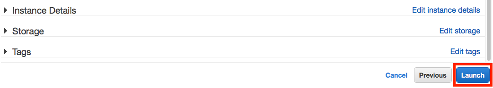

The final step is to create an SSH key pair to remotely connect to your EC2 instance. To do so type in a key pair name (`default`) and click `Download Key Pair`. It is important to remember the location of the downloaded key. If you lose this key you will be unable to access the EC2 instance. A recommended strategy to store AWS key pairs is to place it in a hidden folder easily accessible from your home folder (`~/.aws`).

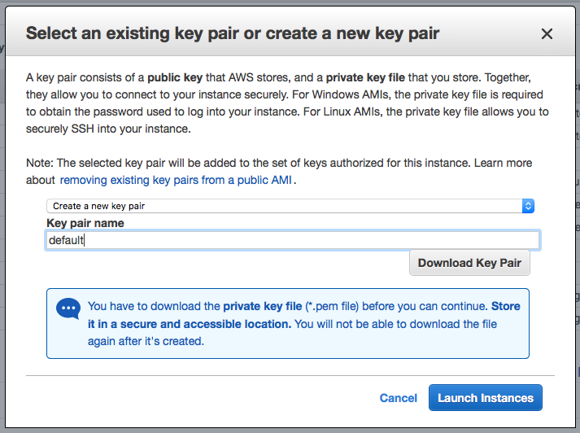

Before continuing, open a terminal and navigate to the location of your saved key. If you did not create a `~/.aws` folder to place your key and would like to do so now, use the following commands:
```
mkdir ~/.aws
mv name_of_your_key.pem ~/.aws/default.pem
```

Note that some OS's may automatically append a `*.txt` to the end of your `*.pem` file when downloading. If so the `mv` command above wil rename your file appropriately. At this time, also go ahead and change the permissions on the SSH key to not be publically viewable (otherwise SSH client will not accept the key):
```
chmod 400 ~/.aws/default.pem
```

Returning back to the web browser, click `Launch Instance` to complete the EC2 creation process.

# Accessing AWS Instance

### Launch EC2 instance 

Upon creating your EC2 instance with the instructions, the new EC2 instance will be automatically started. On each subsequent future session, you will have to start (e.g. boot) your EC2 instance before you can connect and use it. To do so, select the `Instances` link on the left hand toolbar, select the instance you want to boot (blue check box to the left of the instance name), select `Actions` > `Instance State` > `Start`. Your EC2 instance will be ready to connect in about 30-60 seconds.

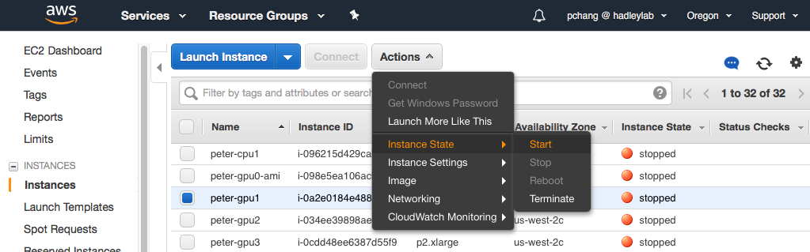

### SSH into EC2 instance

There are two options to start a remote connection to your EC2 instance. Instructions can be found by selecting a particular EC2 instance (blue check box to the left of the instance name) and clicking the `Connect` button. 

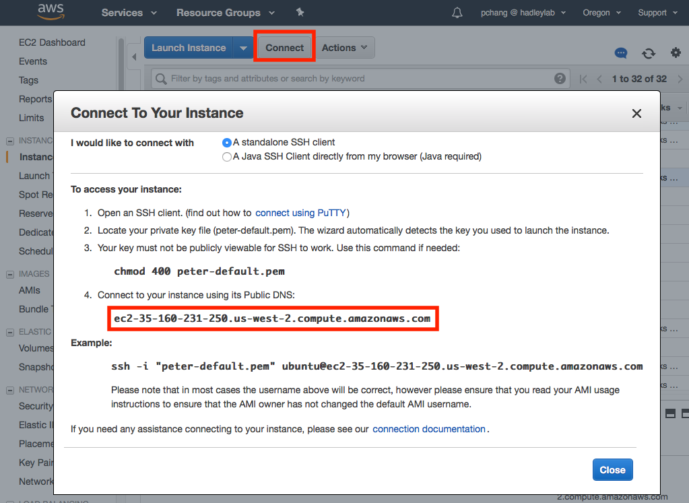

The recommended option is to connect through a standalone SSH client (from your local machine) of your choice. For Max OS X users, the default SSH client located in the Terminal appliation (Applications > Utilities) is recommended. After opening a terminal session, type in the following command:
```
ssh -i "/path/to/your/pem/file" ubuntu@[ec2-public-dns]
``` 
Note the you should replace [ec2-public-dns] with your EC2 instances public DNS. In the above screenshot this would be `c2-35-160-231-250.us-west-2.compute.amazonaws.com`. Assuming that your SSH key is located at `~/.aws/default.pem` (if you followed the instructions per EC2 creation above) then the full command would be:
```
ssh -i "~/.aws/default.pem" ubuntu@c2-35-160-231-250.us-west-2.compute.amazonaws.com
```

You should now be successfully logged into your remote SSH session. Make note of the IP address of your EC2 instance for launching a Jupyter notebook (see below).

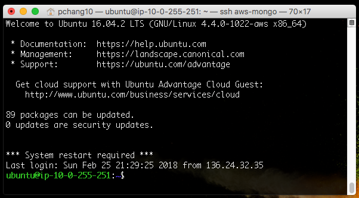

### Stop EC2 instance 

AWS charges a fixed cost per hour of EC2 instance usage, proprated to the second. To keep your charges low, it is advised to stop (e.g. turn off) your EC2 instance whenever your are finished. To do so, select the `Instances` link on the left hand toolbar, select the instance you want to boot, select `Actions` > `Instance State` > `Stop`.

# Starting Jupyter Notebook 

During the tutorial session, all code written by the participants will be completed using the Jupyter notebook, an iPython kernel / server that will be running from your own personal AWS instance and accessed through a web-browser. Through this web-based interface one will be able to write, edit and run code in an easy way without needing to use the Linux command line. For more advanced users, this entire Github repository is available for access from the command line at `~/dl_tutorial`. See below for more information.

### Starting Jupyter server

First log into your EC2 instance and make note of the public IP address of your instance in the command prompt (see screenshot above). Alternatively the IP address can be found in the `Instances` menu of the EC2 dashboard:

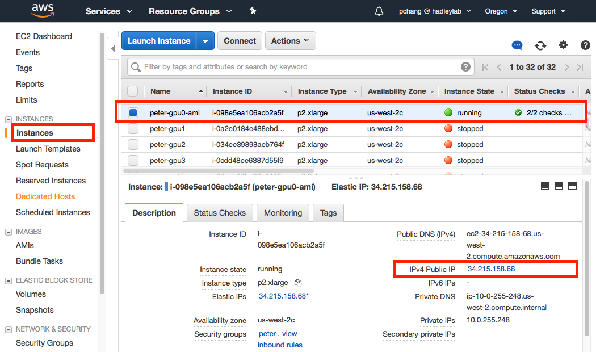

A preconfigured Jupyter server has been set up on the EC2 instance broadcasting on port 8888. To run this server simply run the following bash script after connecting to your EC2 instance (located in your home folder):
```
./start_jupyter.ssh
```

The Jupyter server will now be active listening of port 8888. Make careful note of the suffix of the provided address including login token:

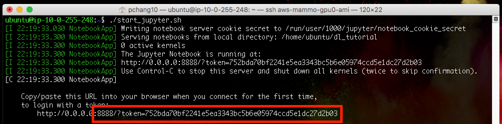

To connect to this Jupyter server, open a web-browser (e.g. Google Chrome), replace the `0.0.0.0` in the provided address with your own public IP address and enter the entire stringinto the address bar. In the above screenshots, the public IP address is `34.215.158.68` therefore the address is:

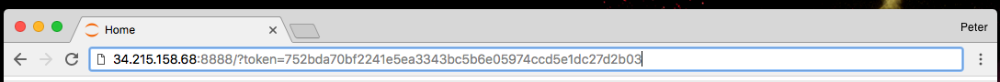

Press `[enter]` to navigate to the web page. You now have access to a web-based iPython kernel though the Jupyter otebook. You also have access the files on your AWS EC2 instance. By default you will login into a copy of this Github code repository pre-configured into your EC2 instance:

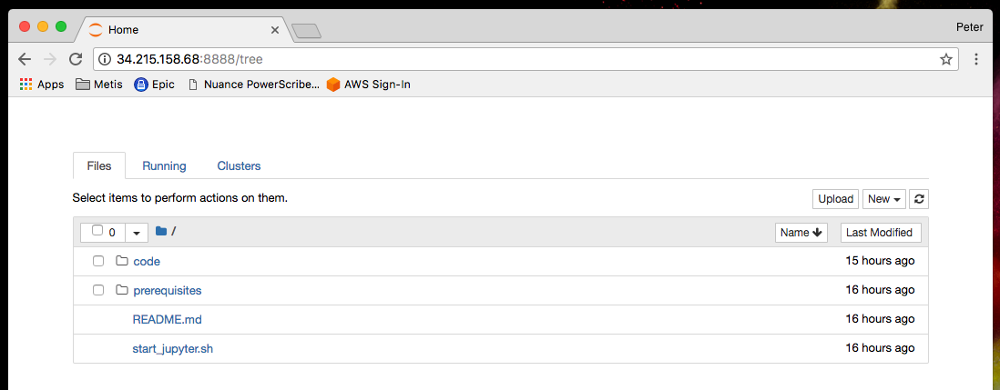

Click on the `Code` folder to open and access the template code provided for you as part of this tutorial. If you are unfamiliar with Jupyter you can launch the `hello_tensorflow.ipynb` notebook to walk through a basic working example by simply clicking on it:

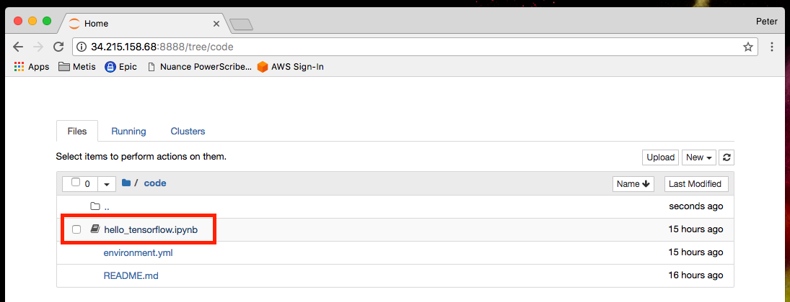
 
You should now have access to our first example Jupyter notebook. Feel free to walk through this template, execute the code (which will be run on your EC2 instance) and edit as you see fit.

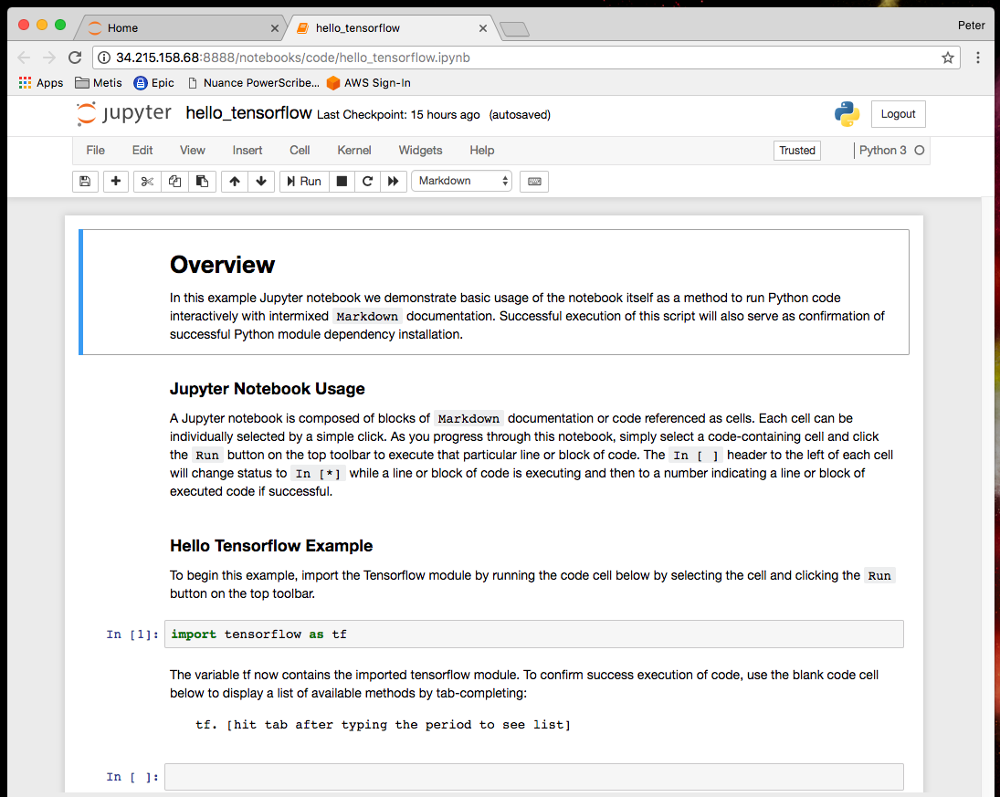

# Advanced Users

For more advanced users wishing to follow along directly through the EC2 command line instead of the Jupyter otebook, these are instructions for basic access. In the EC2 instance, all required dependencies have been installed in a separate Conda virtual enivornment named `dl_aws`. To activate simply run:
```
source activate dw_aws
```

From here simply access code and materials from this cloned Github repository at `~/dl_tutorial`. You may use your favorite editor. Note that `vim` has been preconfigured with syntax highlighting, Vundle and several useful plugins for Python development (see `~/.vimrc` for further details). Code may be executed with either `python` or the `ipython` kernel.
