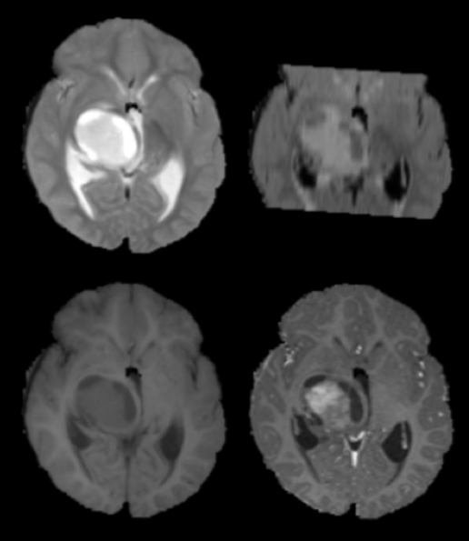
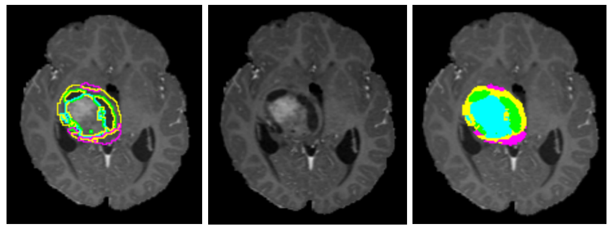

# Overview

The data from this tutorial comes from the 2016 MICCAI Brain Tumor Segmentation Challenge (BRaTS). Using this data, the goal of the challenge is to generate segmentation masks demarcating various brain tumor components from 3D MR imaging volumes.

### Data inputs

Inputs into the CNN consist of matrices of size 1 x 256 x 256 x 4, where the four separate channels represent the four different MRI modalities common in neuroimaging applications:
```
dat[..., 0] = T2
dat[..., 1] = FLAIR
dat[..., 2] = T1 precontrast
dat[..., 3] = T1 postcontrast
```



### Label outputs 

Output labels from the CNN consist of matrices of size 1 x 256 x 256 x 1. At each voxel location, there are one of 5 possible labels:
```
0 = background (no tumor)
1 = non-enhancing tumor 
2 = edema
3 = necrosis
4 = enhancing tumor
```



Note that in the above, yellow == non-enhancing tumor, pink == edema, green == necrosis, blue == enhancing tumor.

### Data format

For this tutorial, all the original data and annotations are converted from original raw `*.mha` format into memory-mapped Numpy arrays, `*.npy`. This format can be easily loaded without external dependencies (only Numpy library required), and by memory-mapping the data in slice-contiguous format, random individual slices of data can be loaded efficiently into memory. 

The full dataset (all ~200 patients) is preloaded in the AWS EC2 instance (see https://github.com/peterchang77/dl_tutorial for more information). A small subset of 5 patients is provided here for demonstration purposes.

### Data I/O

The data.py module in the `dl_tutorial/code` directory contains a method that abstracts a pipeline for loading random slices of preprocessed data in either training or validation cohorts.

```
import data

dat, lbl = data.load(mode='train', n=16)

```
